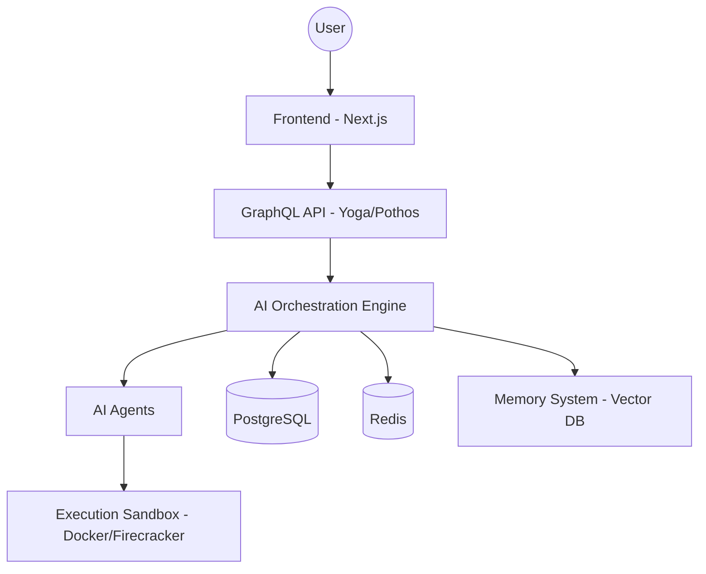

# Aether Architecture

Aether is designed as a multi-agent system coordinating through a central orchestration engine.

## High-Level Diagram

## Components

### Frontend
- **Tech Stack:** Next.js 15, React 19, TailwindCSS, shadcn/ui.
- **Features:** Browser-based IDE (Monaco), Terminal, Real-time collaboration.

### Backend
- **Tech Stack:** Node.js, GraphQL (Yoga + Pothos), PostgreSQL (Prisma), Redis.
- **Services:** API Gateway, Auth, Real-time (WebSockets), Billing.

### AI Orchestration
- **Tech Stack:** LangChain/Custom DAG engine.
- **Features:** Model routing (OpenAI, Anthropic, Gemini), Context engine, Memory management.

### Infrastructure
- **Tech Stack:** Kubernetes, Terraform, AWS/GCP, Docker.
- **Execution:** Isolated sandboxes for agent code execution and deployments.

## Security
- Network isolation for sandboxes.
- Resource quotas and rate limiting.
- SOC2-compliant audit trails.
